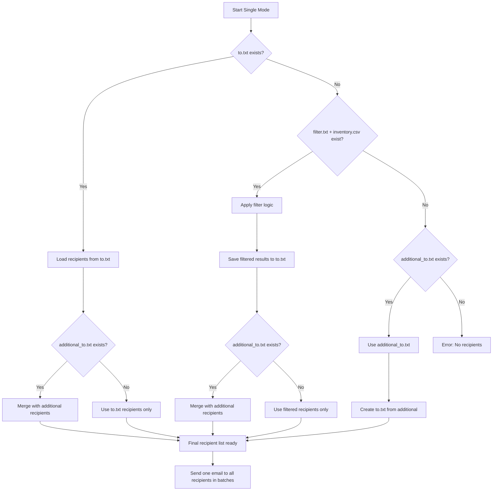
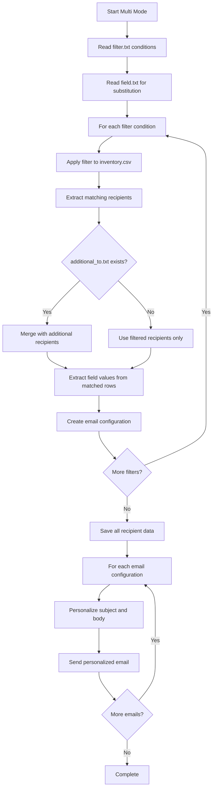

# NotifyBot: Single vs Multi Mode - Complete Guide

## Overview

NotifyBot is an automated email batch sender that operates in two distinct modes:
- **Single Mode**: Sends ONE email to MULTIPLE recipients
- **Multi Mode**: Sends MULTIPLE personalized emails based on filter conditions

## Mode Selection Logic

The mode is determined by this priority order:
1. **CLI argument** (`--mode single` or `--mode multi`)
2. **mode.txt file** in the base folder
3. **Default**: single mode

## Single Mode

### How Single Mode Works

Single mode sends one email to multiple recipients. It's designed for broadcasting the same message to a large audience.

**Key Characteristics:**
- One email content for all recipients
- Recipients are batched for delivery (default: 500 per batch)
- CC and BCC recipients receive the same email
- No personalization or template substitution

### Recipient List Preparation in Single Mode

The system follows this priority order to determine recipients:

#### Priority 1: Existing `to.txt` file
```
If to.txt exists → Use recipients from to.txt
```

#### Priority 2: Filter Logic (if no `to.txt`)
```
If filter.txt + inventory.csv exist → Apply filters to generate recipients → Save to to.txt
```

#### Priority 3: Additional Recipients Only
```
If only additional_to.txt exists → Use those recipients → Create to.txt
```

#### Merging Logic
- If `additional_to.txt` exists alongside other sources, recipients are merged
- Duplicates are automatically removed (case-insensitive)
- Final recipient list is saved to `to.txt` for future reference

### Single Mode File Structure
```
emails/
├── mode.txt (optional: "single")
├── subject.txt (required)
├── body.html (required)
├── from.txt (required)
├── approver.txt (required)
├── to.txt (auto-generated or manual)
├── additional_to.txt (optional)
├── cc.txt (optional)
├── bcc.txt (optional)
├── filter.txt (optional - for generating to.txt)
├── attachment/ (optional)
└── images/ (optional)
```

### Single Mode Process Flow


## Multi Mode

### How Multi Mode Works

Multi mode sends multiple personalized emails based on filter conditions. Each line in `filter.txt` creates a separate email campaign.

**Key Characteristics:**
- Multiple individual emails (one per filter condition)
- Each email can be personalized using template substitution
- Recipients are determined by filter conditions applied to inventory.csv
- Each email includes the same CC/BCC recipients (if specified)

### Recipient List Preparation in Multi Mode

1. **Read filter conditions** from `filter.txt`
2. **For each filter line:**
   - Apply filter to `inventory.csv`
   - Extract matching recipients
   - Merge with `additional_to.txt` (if exists)
   - Create personalized email configuration
3. **Save recipient data** to `recipients/` folder for reference

### Multi Mode File Structure
```
emails/
├── mode.txt (optional: "multi")
├── subject.txt (required - template)
├── body.html (required - template)
├── from.txt (required)
├── approver.txt (required)
├── filter.txt (required)
├── field.txt (optional - for template substitution)
├── additional_to.txt (optional - added to each email)
├── cc.txt (optional - added to each email)
├── bcc.txt (optional - added to each email)
├── attachment/ (optional)
├── images/ (optional)
└── recipients/ (auto-generated)
    ├── filter_001_department_sales.txt
    ├── filter_002_region_north.txt
    ├── multi_mode_summary.txt
    └── all_unique_recipients.txt
```

### Multi Mode Process Flow


## Filter.txt File Logic

### Purpose
The `filter.txt` file contains conditions that determine which rows from `inventory.csv` should receive emails.

### Syntax
NotifyBot uses **PromQL-style syntax** with enhanced operators:

#### Basic Operators
- `=` : Exact match (case-insensitive)
- `!=` : Not equal (case-insensitive)
- `=~` : Regex match (case-insensitive)
- `!~` : Regex not match (case-insensitive)

#### Wildcard Operators
- `*` : Matches any sequence of characters
- `?` : Matches any single character
- `[seq]` : Matches any character in sequence
- `[!seq]` : Matches any character not in sequence

#### Logic Operators
- `,` (comma) : AND condition within same line
- New line : OR condition between lines
- `#` : Comment lines (ignored)

### Filter Examples

#### Basic Filtering
```bash
# Send to all sales department
department="sales"

# Send to everyone except contractors
name!~".*(Contract|Temp|Intern).*"

# Send to active employees in specific regions
status="active"
region=~"north|south|east"
```

#### Complex AND/OR Logic
```bash
# Sales in North America OR Marketing globally
department="sales",country=~"USA|Canada|Mexico"
department="marketing"

# Engineering team in English-speaking countries
department="engineering",country=~"USA|Canada|UK|Australia"
```

#### Wildcard Examples
```bash
# All managers
title=*Manager*

# All emails ending with company domain
email=*@company.com

# Department codes starting with 'IT'
dept_code=IT*

# Exclude test accounts
email!~".*test.*"
```

### Filter Processing Logic

1. **Parse each line** as a separate OR condition
2. **Within each line**, comma-separated conditions are AND conditions
3. **For each row in inventory.csv:**
   - Check if it matches ANY line (OR logic)
   - For each line, ALL conditions must match (AND logic)
4. **Extract email addresses** from matching rows
5. **Validate and deduplicate** email addresses

## Field.txt File Logic

### Purpose
The `field.txt` file specifies which fields from `inventory.csv` should be used for template substitution in multi mode.

### How It Works

#### 1. Field Definition
List field names (one per line) that exist as columns in `inventory.csv`:
```
department
region
country
manager_name
```

#### 2. Value Extraction Process
For each filter condition:
1. **Find all rows** that match the filter
2. **Extract unique values** for each specified field from matched rows
3. **Combine values** into comma-separated strings
4. **Store field-value mappings** for template substitution

#### 3. Template Substitution
Replace placeholders in subject and body templates:
- `{department}` → `"sales,sales_north"`
- `{region}` → `"north,south,east"`

#### 4. Smart Formatting
The system intelligently formats multiple values:
- **1 value**: `sales`
- **2 values**: `sales and marketing`
- **3-5 values**: `sales, marketing, and engineering`
- **6+ values**: `sales, marketing, engineering, and 3 more`

### Template Substitution Examples

#### Subject Template
```
Monthly Report for {department} in {region}
```

#### Body Template
```html
<h1>Department Update</h1>
<p>This report covers activities for the {department} department 
in the {region} region(s).</p>

<p>Report generated for: {country}</p>
```

#### After Substitution (Example)
**Filter**: `department="sales",region!="europe"`
**Matched Data**: 
- department: `sales,sales_north`
- region: `north,south,asia`
- country: `USA,Canada,Japan`

**Result**:
- **Subject**: `Monthly Report for sales and sales_north in north, south, and asia`
- **Body**: Contains personalized department and region information

## Key Differences Summary

| Aspect | Single Mode | Multi Mode |
|--------|-------------|------------|
| **Emails Sent** | 1 email | Multiple emails |
| **Recipients** | All in one email | Segmented by filters |
| **Personalization** | None | Template substitution |
| **filter.txt** | Optional (for generating to.txt) | Required (defines segments) |
| **field.txt** | Not used | Optional (for personalization) |
| **Use Case** | Announcements, newsletters | Segmented campaigns, personalized reports |
| **Complexity** | Simple broadcast | Advanced targeting |

## Dry-Run Mode

Both modes support dry-run functionality:
- **Purpose**: Send draft emails to approvers only
- **Subject**: Prefixed with "DRAFT - "
- **Recipients**: Only approvers receive emails
- **Content**: Includes disclaimer with original recipient counts
- **Preservation**: Original recipient lists are saved but not overwritten

This comprehensive system allows for both simple broadcast emails and sophisticated, personalized email campaigns based on dynamic filtering and template substitution.
